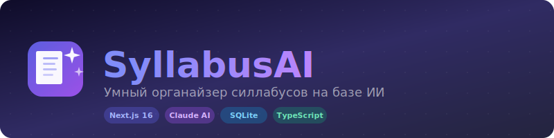

<p align="center">
  
</p>

<p align="center">
  <b>Загружай силлабусы → получай красивую структуру за секунды</b>
</p>

<p align="center">
  
  
  
  
  
</p>

---

## ✨ Что это

**SyllabusAI** — веб-приложение для студентов, которое превращает скучные многостраничные силлабусы в удобные структурированные карточки. Загружаешь PDF или DOCX, Claude AI разбирает содержимое и выдаёт всё важное в красивом виде.

---

## 🚀 Фичи

| | Фича | Описание |
|---|---|---|
| 📤 | **Умная загрузка** | Drag & drop PDF / DOC / DOCX, до 10MB |
| 🤖 | **AI-парсинг** | Claude автоматически извлекает структуру, дедлайны, оценки, расписание |
| 📚 | **Карточки предметов** | Эмодзи и цвет по типу предмета (📐 Math, ⚛️ Physics, 💻 CS...) |
| 🔍 | **Умный поиск** | Fuzzy-поиск по названию, преподавателю, темам (Fuse.js) |
| 📅 | **Дедлайн-трекер** | Все дедлайны всех предметов в одном месте с группировкой по срочности |
| 📊 | **Структура оценок** | Визуальные прогресс-бары для каждого типа работ |
| 🗓️ | **Расписание тем** | Список тем по неделям из силлабуса |
| 📜 | **Правила курса** | Attendance, late policy, academic integrity — всё структурировано |
| ⚡ | **Алерты** | Баннер с ближайшими дедлайнами прямо на дашборде |

---

## 🛠 Стек

```
Frontend   Next.js 16 (App Router) · TypeScript · Tailwind CSS 4
Backend    Next.js API Routes · Prisma 7 · SQLite (better-sqlite3)
AI         Anthropic Claude claude-sonnet-4-6
Search     Fuse.js (fuzzy search)
Parsing    pdf-parse · mammoth (DOCX)
```

---

## ⚡ Быстрый старт

```bash
# 1. Клонируй репозиторий
git clone https://github.com/unsaiddream/structured
cd structured

# 2. Установи зависимости
npm install

# 3. Настрой окружение
cp .env.example .env
# Вставь свой ANTHROPIC_API_KEY в .env

# 4. Подними базу данных
npx prisma migrate dev

# 5. Запускай!
npm run dev
```

Открой [http://localhost:3000](http://localhost:3000) 🎉

---

## 🔑 Переменные окружения

```env
ANTHROPIC_API_KEY="sk-ant-..."   # Получить на console.anthropic.com
DATABASE_URL="file:./dev.db"     # SQLite, менять не нужно
```

---

## 📁 Структура проекта

```
src/
├── app/
│   ├── page.tsx                  # Дашборд
│   ├── deadlines/page.tsx        # Все дедлайны
│   ├── syllabus/[id]/page.tsx    # Детальная страница предмета
│   └── api/
│       ├── upload/route.ts       # POST — загрузка файла
│       ├── syllabuses/route.ts   # GET — список
│       ├── syllabuses/[id]/      # GET/DELETE — один силлабус
│       └── search/route.ts       # GET?q= — поиск
├── components/
│   ├── UploadZone.tsx            # Drag & drop зона
│   ├── SyllabusCard.tsx          # Карточка предмета
│   └── SearchBar.tsx             # Поиск с дебаунсом
└── lib/
    ├── db.ts                     # Prisma клиент
    ├── parser.ts                 # PDF/DOCX → текст
    └── structurer.ts             # Claude AI структурирование
```

---

## 💰 Стоимость API

Каждая загрузка силлабуса — один вызов Claude (~$0.027).
**$5 = ~185 силлабусов** — хватит на все семестры бакалавриата.

---

## 📄 Лицензия

MIT — делай что хочешь.
